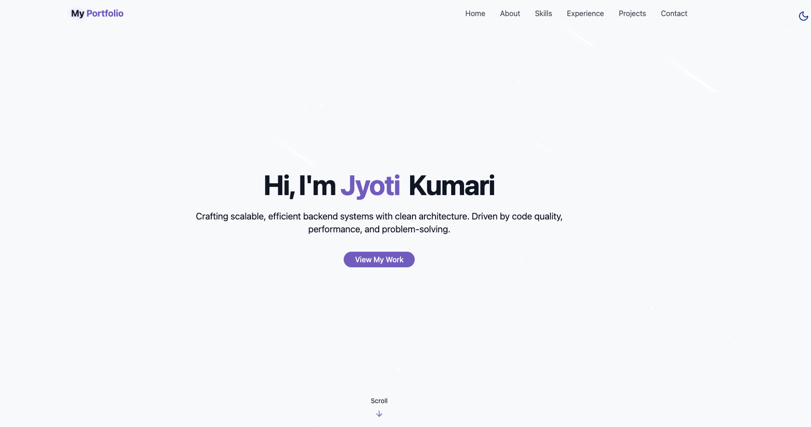
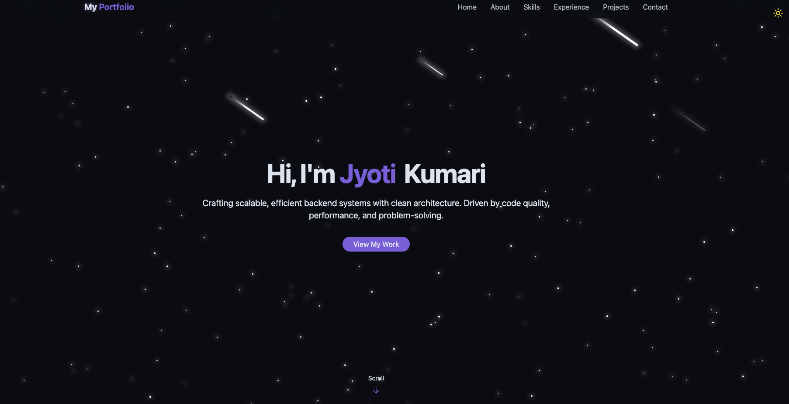

# Built a Modern Portfolio Website with React & TailwindCSS

## ⚙️ Tech Stack

* **React** – Component-based UI development
* **Vite** – Lightning-fast build tool
* **TailwindCSS** – Utility-first CSS for styling
* **Lucide Icons** – Clean and beautiful icon pack
* **Radix UI** – Accessible component primitives
* **TypeScript (optional)** – Type safety and tooling
* **GitHub & Vercel** – Deployment

---

## ⚡️ Features

* 🌑 **Light/Dark Mode Toggle**
  Save theme preference in local storage with beautiful transitions

* 💫 **Animated Backgrounds**
  Stars, meteors, scroll effects, and glowing UI elements

* 📱 **Responsive Navigation**
  Desktop and mobile menus with glassmorphism

* 👨‍💻 **Hero & About Sections**
  Showcase who you are with smooth intro animations and buttons

* 📊 **Skills Section**
  Showcases my backend skills

* 📊 **Experience Section**
  Showcases my 2+ years of experience

* 🖼️ **Projects Showcase**
  Display screenshots, tech stacks, and GitHub/demo links

* 📩 **Contact Section**
  Social icons + responsive contact form with toast notifications

* 🚀 **One-Click Deployment**
  Easily host your site with Vercel and GitHub

---

## 👌 Quick Start

### Prerequisites

* [Node.js](https://nodejs.org/)
* [Git](https://git-scm.com/)

### Clone and Run

```bash
git clone https://github.com/yourusername/react-tailwind-portfolio.git
cd Portfolio
npm install
npm run dev
```

Your app will be available at: [http://localhost:5173](http://localhost:5173)

---

## 🖼️ Screenshots





---

## ☁️ Deployment

### Deploy on Vercel

1. Push your code to GitHub
2. Go to [vercel.com](https://vercel.com)
3. Import your repository
4. Click **Deploy**

Your live website will be hosted on a custom subdomain (e.g. `https://your-name.vercel.app`)

---

## 🔗 Useful Links

* [React Documentation](https://reactjs.org/)
* [Tailwind CSS Docs](https://tailwindcss.com/)
* [Lucide Icons](https://lucide.dev/)
* [Radix UI](https://www.radix-ui.com/)
* [Vite](https://vitejs.dev/)
* [Vercel](https://vercel.com/)

---

Let me know if you'd like me to generate a version with your actual GitHub repo, YouTube URL, or a banner image suggestion!
